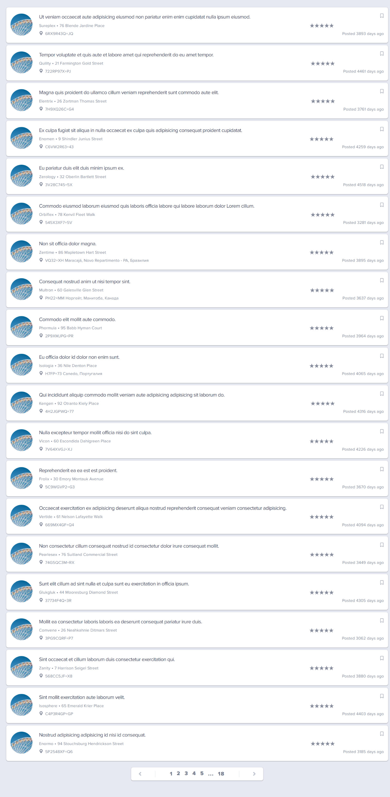
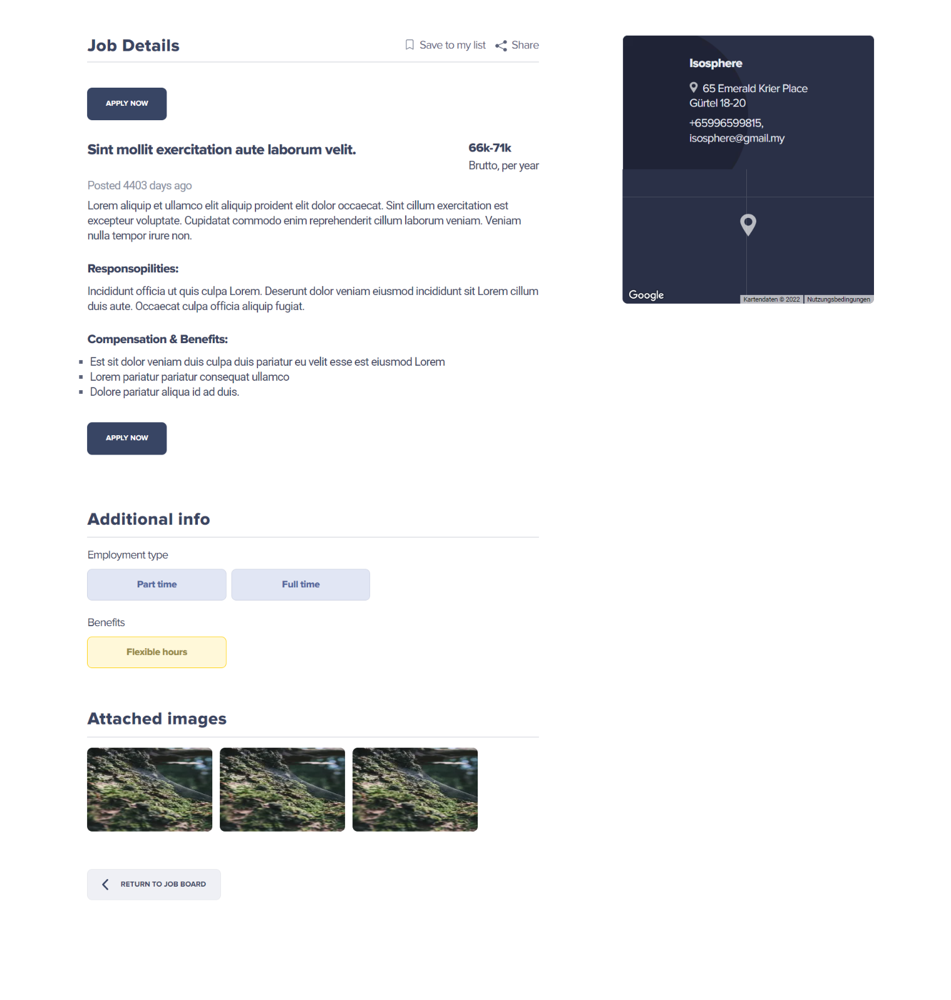

###  An implementation of the `Job List` using:
- HTML/CSS
- Tailwind
- Typescript
- NextJs

Generation a list of jobs from the data received from the API.
On click on the "Job title", a detailed job page opens.

